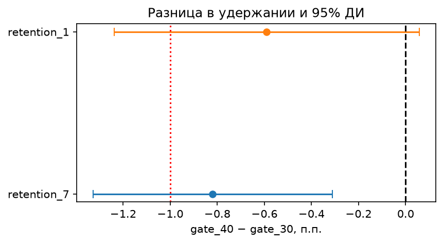
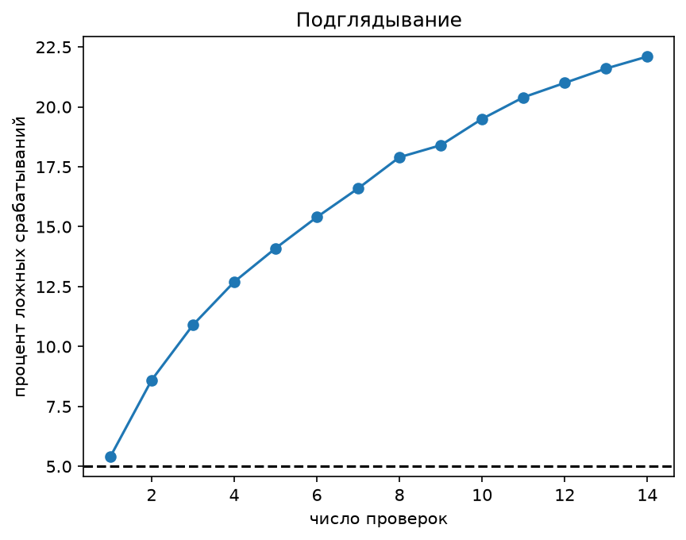
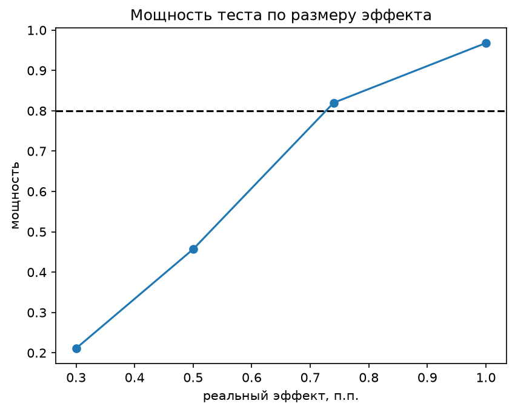

# Cookie Cats: переносить ли gate с 30 на 40 уровень

> **Не переносить.** В gate_40 на 7-й день возвращается на 0,8 п.п. меньше игроков (19,0% против 18,2%, 95% ДИ от −1,3 до −0,3).

## О проекте

В мобильной игре Cookie Cats есть ворота: на определённом уровне надо либо ждать, либо платить. Разработчики разделили новых игроков на две группы: в одной первые ворота стоят на 30-м уровне, в другой на 40-м.

Данные — публичный датасет с Kaggle, 90 189 игроков (gate_30: 44 700, gate_40: 45 489). По каждому есть группа, число раундов за 14 дней и флаги ретеншна D1 и D7.

## Результат

- retention_7, основная метрика: −0,82 п.п., z-тест p = 0,0016, 95% ДИ от −1,33 до −0,31. Бутстреп даёт почти такой же интервал (от −1,32 до −0,33).
- retention_1, гардрейл: −0,59 п.п., ДИ от −1,24 до +0,06. Нижняя граница ниже −1 п.п., гардрейл не прошёл. На решение это не влияет: по правилу гардрейл важен, только если retention_7 вырос.
- sum_gamerounds: разницы не нашли, разница средних −1,2, бутстреп-ДИ от −4,0 до +1,0. Значит, ретеншн упал не потому, что в gate_40 меньше играют.

Решение на одну страницу: [docs/decision.md](docs/decision.md).

## Как считал

Гипотезу, метрики и правило решения записал в [docs/test_design.md](docs/test_design.md) до расчёта эффекта. Доли по группам я к тому моменту уже видел, так что полноценной пререгистрацией это не назвать.

Дублей по userid нет. SRM: χ² = 6,90, p = 0,0086. В дизайне порог p < 0,001, так что формально SRM не сработал, но порог я выбрал, уже зная p-value: при 0,05 проверка бы сработала, и перекос (0,44 п.п.) значим также на 0,01. Откуда он, по данным не понять.

MDE при таких группах (α = 5%, мощность 80%): 0,74 п.п. по retention_7 и 0,93 п.п. по retention_1.

Доли сравнивал z-тестом с 95% ДИ разницы и сверял бутстрепом. По раундам только бутстреп средних. Распределение сильно скошено (среднее 51, медиана 16), а Манн — Уитни сравнивает распределения целиком и разницу средних не показывает.

Методы проверил симуляциями в notebooks/03_checks.ipynb:
- A/A на реальных данных: 2000 раз перемешал метки групп, p < 0,05 в 5,25% запусков, критерий не врёт.
- Подглядывание: если проверять тест 14 раз и останавливать на первом p < 0,05, ложных срабатываний 22% вместо 5%.
- Мощность: реальный эффект 0,74 п.п. тест ловит в 82% запусков, 0,5 п.п. в 46%, 0,3 п.п. в 21%.
- Поправка Холма на примере трёх метрик.
- CUPED (синтетические данные): при корреляции 0,6 дисперсия падает на 37%. На реальных данных не применял: предтестовой метрики в датасете нет, а sum_gamerounds собрана уже после воздействия.

| Подглядывание | Мощность |
| --- | --- |
|  |  |

## Ограничения

- Платежей в данных нет. Ворота — ещё и точка монетизации, так что gate_40 мог поднять выручку, а этот тест этого не покажет.
- По ретеншну данные только за 1-й и 7-й день, долгий ретеншн не виден.
- В gate_30 есть игрок с 49 854 раундами. Из основного анализа я его не выкидывал.

Полный список: [docs/limitations.md](docs/limitations.md).

## Что в репозитории

- `docs/test_design.md`: дизайн теста до анализа
- `docs/decision.md`: решение на одну страницу
- `docs/limitations.md`: ограничения
- `notebooks/01_design.ipynb`: данные, SRM, MDE
- `notebooks/02_effect.ipynb`: оценка эффекта
- `notebooks/03_checks.ipynb`: проверки методов симуляциями

## Как запустить

Python 3.12. Скачать cookie_cats.csv с Kaggle (mobile-games-ab-testing) в `data/`, затем `pip install -r requirements.txt` и открыть ноутбуки по порядку.